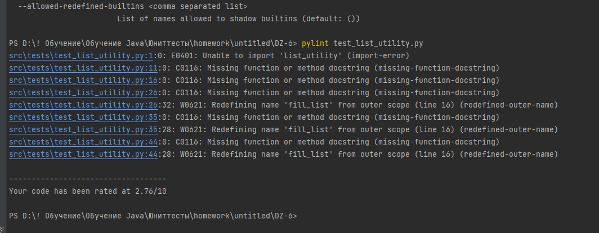
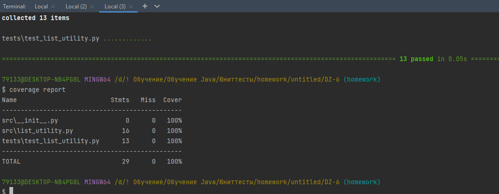

Задание. Создайте программу на Python или Java, которая принимает два списка чисел и выполняет следующие действия:
a. Рассчитывает среднее значение каждого списка.
b. Сравнивает эти средние значения и выводит соответствующее сообщение:
- ""Первый список имеет большее среднее значение"", если среднее значение первого списка больше.
- ""Второй список имеет большее среднее значение"", если среднее значение второго списка больше.
- ""Средние значения равны"", если средние значения списков равны.

# Отчет о выполнении задания
 + Код программы расположен в репозитории по [ссылке](https://github.com/ErmolaevaOlga/Testing/blob/homework6/DZ-6/src/list_utility.py)
 + Код тестов к написанному коду расположен по [ссылке](https://github.com/ErmolaevaOlga/Testing/blob/homework6/DZ-6/tests/test_list_utility.py)
 + Отчет pylint 
 + Отчет о покрытии тестами 
 + Объяснение того, какие сценарии покрыты тестами и почему
 
    В рамках решения задачи я реализовала методы в соответствии с принципами объектно-ориентированного программирования,
создала сущность у которой 4 свойства - 2 списка и 2 значения среднего значения списка, которые рассчитывались методом класса. В тестах 
я в первуюю очередь проверила рассчет среднего значения используя параметризацию для различных вводимых данных.
Далее нужно было проверить функцию сравнения списков. Для этого я создала фикстуру, в которой создала экземпляр объекта класса. 
Далее используя свойсвто переметра indirect я параметризовала тесты которые передавали в фикстуру разные значения списков.
Таким образом я создала 3 теста с параметризацией на проверку следующих случаев: когда средние значения равны, когда первый список имеет большее 
среднее значение, когда второй список имеет большее среднее значение.
